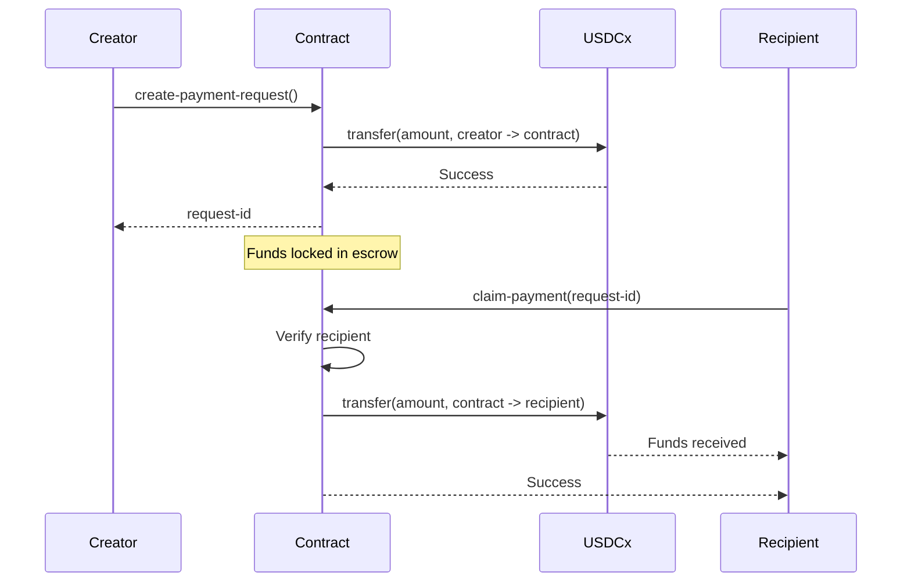
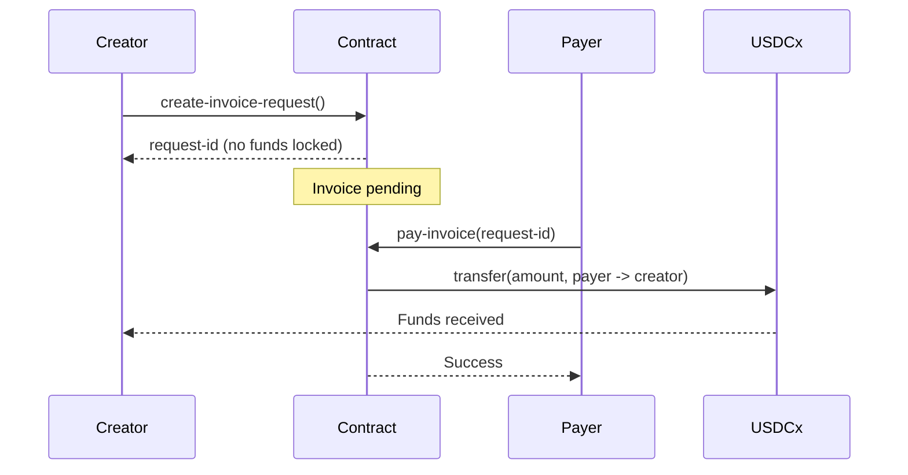

<div align="center">

# StackPay Smart Contracts

### Clarity Smart Contracts for USDCx Payments

[](https://clarity-lang.org/)
[](https://www.stacks.co/)
[](https://docs.hiro.so/clarinet)

</div>

---

## Overview

This directory contains the Clarity smart contracts that power StackPay's payment functionality on the Stacks blockchain. The contracts handle escrow payments, invoice requests, and username registration—all integrated with USDCx.

---

## Contracts

### 1. `payment-requests.clar`

The core payment contract managing escrow and invoice payment flows.

#### Features
- **Escrow Payments**: Lock USDCx in contract until recipient claims
- **Invoice System**: Create payment requests without locking funds
- **Payment Tracking**: On-chain event logging and statistics
- **Refund Mechanism**: Cancel pending payments and recover funds

#### Public Functions

| Function | Description | Parameters |
|----------|-------------|------------|
| `create-payment-request` | Lock funds in escrow | `request-id`, `recipient`, `amount`, `memo` |
| `create-invoice-request` | Create invoice without escrow | `request-id`, `recipient`, `amount`, `memo` |
| `claim-payment` | Claim escrowed funds (recipient only) | `request-id` |
| `pay-invoice` | Pay an invoice | `request-id` |
| `cancel-payment-request` | Cancel and refund (creator only) | `request-id` |

#### Read-Only Functions

| Function | Description | Returns |
|----------|-------------|---------|
| `get-payment-request` | Get payment details | Payment object or none |
| `get-payment-status` | Get payment status | Status string |
| `get-payment-type` | Get payment type (escrow/invoice) | Type string |
| `is-claimable` | Check if claimable by user | Boolean |
| `is-payable` | Check if invoice is payable | Boolean |
| `get-total-payments-created` | Total payments created | uint |
| `get-total-payments-claimed` | Total payments claimed | uint |
| `get-total-volume` | Total USDCx volume | uint |
| `get-user-payment-count` | Payments by user | uint |

#### Error Codes

| Code | Constant | Description |
|------|----------|-------------|
| u401 | `err-not-authorized` | Caller not authorized |
| u404 | `err-not-found` | Payment not found |
| u400 | `err-already-claimed` | Payment already claimed |
| u402 | `err-invalid-amount` | Invalid amount (must be > 0) |
| u405 | `err-transfer-failed` | USDCx transfer failed |
| u406 | `err-already-exists` | Request ID already exists |
| u407 | `err-invalid-request-id` | Invalid request ID format |

#### Data Structures

```clarity
;; Payment Request
{
  creator: principal,
  recipient: principal,
  amount: uint,
  memo: (string-utf8 256),
  request-type: (string-ascii 10),    ;; "escrow" or "invoice"
  status: (string-ascii 10),          ;; "pending", "completed", "cancelled", "paid"
  created-at: uint,
  created-at-burn-height: uint,
  claimed-at: (optional uint),
  claimed-at-burn-height: (optional uint)
}
```

---

### 2. `username-registry.clar`

On-chain username registration for human-readable addresses.

#### Features
- **Username Registration**: Claim @username (3-20 characters)
- **Address Resolution**: Look up address by username
- **Reverse Lookup**: Find username by address
- **Uniqueness**: One username per address, one address per username

#### Public Functions

| Function | Description | Parameters |
|----------|-------------|------------|
| `register-username` | Register a new username | `username` (string-ascii 20) |

#### Read-Only Functions

| Function | Description | Returns |
|----------|-------------|---------|
| `get-address` | Get address for username | Principal or error |
| `get-username` | Get username for address | String or error |

#### Error Codes

| Code | Constant | Description |
|------|----------|-------------|
| u100 | `err-username-taken` | Username already registered |
| u101 | `err-username-not-found` | Username does not exist |
| u102 | `err-invalid-username` | Username too short (< 3 chars) |

#### Data Structures

```clarity
;; Username mapping
{
  owner: principal,
  registered-at: uint
}
```

---

## Directory Structure

```
contracts/
├── contracts/
│   ├── payment-requests.clar    # Escrow & Invoice payment logic
│   └── username-registry.clar   # On-chain username registry
├── deployments/                 # Deployment configurations
├── settings/                    # Clarinet project settings
├── tests/                       # Contract unit tests
└── README.md                    # This file
```

---

## USDCx Integration

Both contracts integrate with the USDCx token contract:

```clarity
(define-constant usdcx-contract 'ST1PQHQKV0RJXZFY1DGX8MNSNYVE3VGZJSRTPGZGM.usdcx)
```

### Token Operations
- **Transfer**: Standard SIP-010 `transfer` function
- **Balance**: Check user balances before operations
- **Escrow**: Contract holds funds as intermediary

---

## Payment Flows

### Escrow Payment Flow



### Invoice Payment Flow



---

## Development

### Prerequisites

- [Clarinet](https://docs.hiro.so/clarinet/getting-started) - Clarity development environment
- [Stacks CLI](https://docs.stacks.co/references/stacks-cli) - Optional for deployment

### Testing

```bash
# Run all tests
clarinet test

# Run specific test
clarinet test tests/payment-requests_test.ts

# Check contracts
clarinet check
```

### Local Development

```bash
# Start local Stacks node
clarinet devnet start

# Deploy contracts locally
clarinet deployments apply -p deployments/default.devnet-plan.yaml
```

### Console Testing

```bash
# Open Clarinet console
clarinet console

# Test functions
(contract-call? .payment-requests get-total-payments-created)
(contract-call? .username-registry get-address "alice")
```

---

## Deployment

### Testnet

Contracts are deployed on Stacks Testnet. Check `frontend/src/utils/stacksUtils.ts` for current addresses.

### Mainnet

For mainnet deployment:
1. Update network configuration
2. Replace testnet USDCx contract address
3. Deploy via Clarinet or Stacks CLI

---

## Security Considerations

1. **Access Control**: Functions verify caller authorization
2. **Reentrancy**: Clarity's design prevents reentrancy attacks
3. **Integer Overflow**: Clarity has built-in overflow protection
4. **Input Validation**: All inputs validated before processing
5. **State Checks**: Status verified before state transitions

---

## Events

The contracts emit events for tracking:

```clarity
(print {
  event: "payment-request-created",
  request-id: request-id,
  request-type: type-escrow,
  creator: tx-sender,
  recipient: recipient,
  amount: amount,
  memo: memo,
  stacks-block: stacks-block-height,
  bitcoin-block: burn-block-height
})
```

Events include:
- `payment-request-created`
- `invoice-created`
- `payment-claimed`
- `invoice-paid`
- `payment-cancelled`

---

## License

MIT License - See [LICENSE](../LICENSE) for details.
